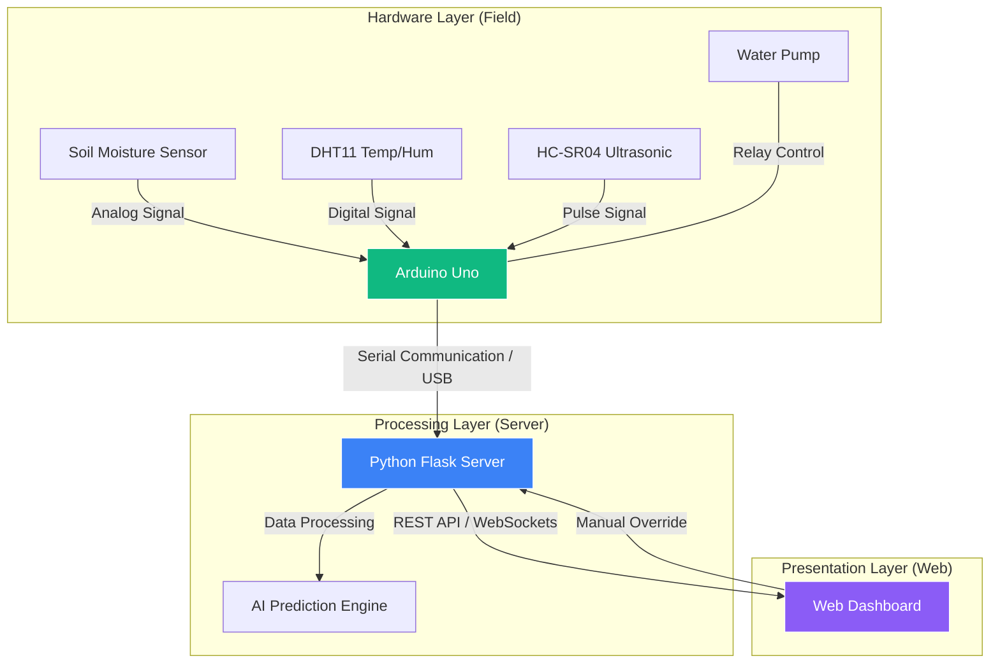

# 🌱 Krishi_Kaar — Smart Agriculture Platform

<div align="center">
  <h3><a href="https://Knight6azer.github.io/Krishi_kaar/">🌐 View Live Demo (Dashboard Preview)</a></h3>
</div>

[]()
[]()
[]()

**Krishi_Kaar** is a precision agriculture platform designed to empower farmers with real-time IoT monitoring and AI-driven insights. It bridges the gap between traditional farming and modern technology through a seamless integration of hardware sensors and a high-performance web dashboard.

---

## 🔄 System Data Flow
The following diagram illustrates how data travels from the physical environment to the user's dashboard and back for control:



---

## 📡 IoT Sensor Specifications

For maximum accuracy and reliability, the platform utilizes three specialized sensors to monitor the most critical environmental parameters:

### 1. Soil Moisture Sensor (Capacitive v1.2)
*   **Purpose**: Measures the volumetric water content in soil.
*   **Operating Principle**: Detects changes in capacitance caused by the presence of water, making it resistant to corrosion compared to resistive sensors.
*   **Data Output**: Analog (0-1023), mapped to **0% (Dry)** to **100% (Wet)**.
*   **Role**: Triggers the AI-managed irrigation pump when moisture drops below 25%.

### 2. DHT11 — Humidity & Temperature
*   **Purpose**: Monitors ambient climate conditions fundamental for crop growth.
*   **Operating Principle**: Digital sensor that integrates a capacitive humidity sensor and a thermistor.
*   **Range**: 20–80% Humidity | 0–50°C Temperature.
*   **Role**: Used by the Random Forest model to predict crop compatibility and fertilizer requirements.

### 3. HC-SR04 — Ultrasonic Sensor
*   **Purpose**: Non-contact distance measurement for monitoring resource levels or presence.
*   **Operating Principle**: Emits ultrasonic bursts (40kHz) and measures the "Time-of-Flight" for the echo to return.
*   **Range**: 2cm to 400cm (±3mm accuracy).
*   **Role**: Monitors water tank levels for irrigation optimization and detects field intrusions.

---

## 🔌 Hardware Connection Guide

If you are setting up the physical hardware, use the following pin configuration for an **Arduino Uno**:

| Component | Arduino Pin | Interface Type | Description |
| :-- | :-- | :-- | :-- |
| **Soil Moisture** | `A0` | Analog Input | Moist sensor Signal |
| **DHT11** | `D2` | Digital Input | Climate Data Pin |
| **HC-SR04 (Trig)** | `D3` | Digital Output | Trigger Pulse |
| **HC-SR04 (Echo)** | `D4` | Digital Input | Echo Timing Pulse |
| **Pump / LED** | `D13 / Built-in` | Digital Output | Irrigation Control |
| **Common** | `5V / GND` | Power | VCC and Ground |

---

## 🖼️ Hardware Showcase

<div align="center">
  <p><b>Physical Sensor Integration (Arduino Uno + DHT11 + Soil Moisture)</b></p>
  
</div>

---

## ⚙️ Data Processing & Calibration

The system includes a sophisticated calibration layer in `src/sensors.py` to ensure data integrity:

1.  **Temporal Smoothing**: Value fluctuations are filtered using a weighted average to prevent "jittery" charts.
2.  **Analog Normalization**: 
    ```python
    # Mapping raw Analog (0-1023) to Percentage
    moisture_percent = round((1023 - raw_val) / 1023 * 100, 2)
    ```
3.  **Simulation Fallback**: If no hardware is detected (`ARDUINO_PORT=None`), the system enters **Simulation Mode**, generating temporally-coherent data based on realistic agricultural models for evaluation.

---

## 🚀 Quick Start & Installation

### Prerequisites
- Python 3.9+
- Arduino IDE (if using hardware)

### Installation
```bash
# 1. Clone & Enter
git clone https://github.com/yourusername/Krishi_Kaar.git
cd Krishi_Kaar

# 2. Setup Environment
pip install -r requirements.txt

# 3. Initialize AI Models
python src/agri_ai.py

# 4. Launch Dashboard
python src/server.py
```

Open `http://localhost:5000` to access the dashboard. 

---

*Built with ❤️ for the next generation of precision agriculture.*
